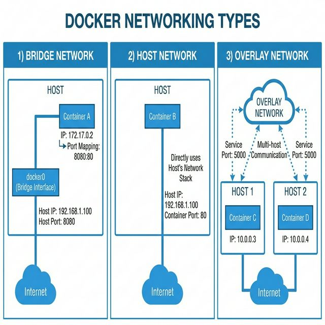

# 📚 Módulo 3: Redes en Docker

> **Comprende cómo los contenedores se comunican entre sí y con el mundo exterior**

## 📋 Contenido del Módulo

| # | Tema | Descripción |
|---|------|-------------|
| 1 | [Tipos de Redes](01-tipos-redes.md) | Bridge, Host, Overlay, None |
| 2 | [Comunicación entre Contenedores](02-comunicacion-contenedores.md) | DNS interno y conexiones |
| 3 | [DNS de Docker](03-dns-docker.md) | Service discovery automático |

## 🎯 Objetivos de Aprendizaje

Al completar este módulo serás capaz de:

- ✅ Entender los diferentes tipos de redes en Docker
- ✅ Crear y gestionar redes personalizadas
- ✅ Conectar contenedores de forma segura
- ✅ Configurar el DNS interno de Docker
- ✅ Aislar servicios usando redes

## 📂 Ejemplos Prácticos

La carpeta [ejemplos/](ejemplos/) contiene:
- `redes-basicas/` - Ejemplos de cada tipo de red
- `multi-red/` - Servicios en múltiples redes
- `aislamiento/` - Segmentación de redes

---

**[← Anterior: Docker Compose](../02-docker-compose/README.md)** | **[Siguiente: Volúmenes →](../04-volumenes/README.md)**
