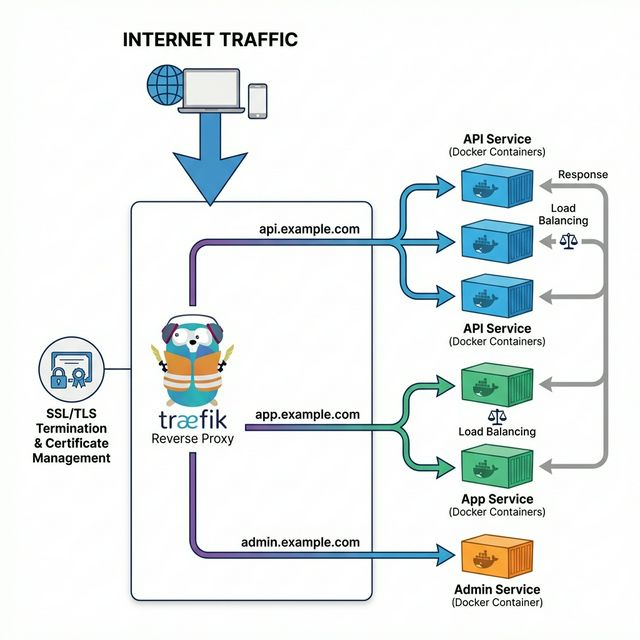

# 📚 Módulo 5: Traefik - Reverse Proxy

> **El proxy inverso moderno para microservicios y contenedores**

## 📋 Contenido del Módulo

| # | Tema | Descripción |
|---|------|-------------|
| 1 | [Introducción a Traefik](01-introduccion-traefik.md) | ¿Qué es y por qué usarlo? |
| 2 | [Configuración Básica](02-configuracion-basica.md) | Setup inicial con Docker |
| 3 | [Labels y Routing](03-labels-routing.md) | Configuración dinámica |
| 4 | [SSL con Let's Encrypt](04-ssl-letsencrypt.md) | Certificados automáticos |
| 5 | [Dashboard](05-dashboard.md) | Monitoreo y administración |

## 🎯 Objetivos de Aprendizaje

Al completar este módulo serás capaz de:

- ✅ Configurar Traefik como reverse proxy para Docker
- ✅ Enrutar tráfico a múltiples servicios por dominio
- ✅ Configurar certificados SSL automáticos con Let's Encrypt
- ✅ Usar middlewares para autenticación, rate limiting, etc.
- ✅ Monitorear servicios con el dashboard de Traefik

## 📂 Ejemplos Prácticos

La carpeta [ejemplos/](ejemplos/) contiene:
- `traefik-basico/` - Configuración mínima
- `traefik-ssl/` - Con Let's Encrypt
- `traefik-auth/` - Con autenticación básica
- `traefik-multi-servicio/` - Múltiples aplicaciones

---

**[← Anterior: Volúmenes](../04-volumenes/README.md)** | **[Siguiente: Microservicios →](../06-microservicios/README.md)**
