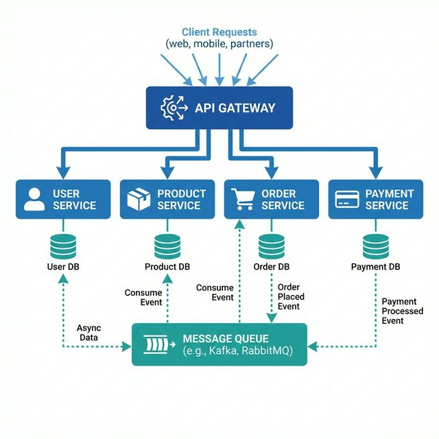

# 📚 Módulo 6: Arquitectura de Microservicios

> **Diseña y despliega aplicaciones distribuidas con Docker**

## 📋 Contenido del Módulo

| # | Tema | Descripción |
|---|------|-------------|
| 1 | [Arquitectura](01-arquitectura.md) | Principios y patrones |
| 2 | [Patrones de Comunicación](02-patrones-comunicacion.md) | Sync vs Async |
| 3 | [Service Discovery](03-service-discovery.md) | Cómo se encuentran los servicios |

## 🎯 Objetivos de Aprendizaje

- ✅ Entender los principios de microservicios
- ✅ Diseñar comunicación entre servicios
- ✅ Implementar patrones comunes con Docker
- ✅ Usar service discovery

---

**[← Anterior: Traefik](../05-traefik/README.md)** | **[Siguiente: Proyectos →](../07-proyectos/)**
