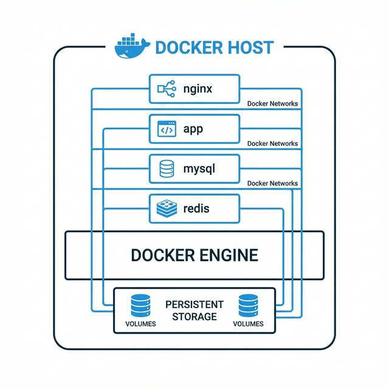

# 🐳 Curso Docker DevOps: De Básico a Avanzado

> **Un curso práctico y completo para dominar Docker en entornos de desarrollo y producción**



## 📋 Índice del Curso

### 🟢 Nivel Básico

| Módulo | Tema | Descripción |
|--------|------|-------------|
| [01](01-fundamentos/) | **Fundamentos de Docker** | Conceptos básicos, instalación, comandos esenciales y Dockerfile |
| [02](02-docker-compose/) | **Docker Compose** | Orquestación local, sintaxis YAML y aplicaciones multi-contenedor |

### 🟡 Nivel Intermedio

| Módulo | Tema | Descripción |
|--------|------|-------------|
| [03](03-redes/) | **Redes en Docker** | Bridge, host, overlay, DNS interno y comunicación entre contenedores |
| [04](04-volumenes/) | **Volúmenes y Persistencia** | Bind mounts, named volumes y estrategias de backup |

### 🔴 Nivel Avanzado

| Módulo | Tema | Descripción |
|--------|------|-------------|
| [05](05-traefik/) | **Traefik - Reverse Proxy** | Routing dinámico, SSL automático, middlewares y dashboard |
| [06](06-microservicios/) | **Arquitectura de Microservicios** | Patrones, service discovery y comunicación entre servicios |
| [07](07-proyectos/) | **Proyectos Prácticos** | Stack completos listos para producción |

---

## 🎯 Objetivos del Curso

Al finalizar este curso serás capaz de:

- ✅ Crear y gestionar contenedores Docker de manera eficiente
- ✅ Escribir Dockerfiles optimizados para producción
- ✅ Orquestar múltiples servicios con Docker Compose
- ✅ Configurar redes personalizadas y comunicación entre contenedores
- ✅ Implementar persistencia de datos con volúmenes
- ✅ Configurar Traefik como reverse proxy con SSL automático
- ✅ Diseñar arquitecturas de microservicios
- ✅ Desplegar stacks completos en producción

---

## 🏗️ Arquitectura de Docker

```
┌─────────────────────────────────────────────────────────────┐
│                        Docker Host                          │
│  ┌───────────────────────────────────────────────────────┐  │
│  │                    Docker Engine                       │  │
│  │  ┌─────────┐  ┌─────────┐  ┌─────────┐  ┌─────────┐   │  │
│  │  │Container│  │Container│  │Container│  │Container│   │  │
│  │  │  nginx  │  │  mysql  │  │   app   │  │  redis  │   │  │
│  │  └────┬────┘  └────┬────┘  └────┬────┘  └────┬────┘   │  │
│  │       │            │            │            │         │  │
│  │  ─────┴────────────┴────────────┴────────────┴─────   │  │
│  │                    Docker Network                      │  │
│  └───────────────────────────────────────────────────────┘  │
│                              │                               │
│  ┌───────────────────────────┴───────────────────────────┐  │
│  │                     Volumes                            │  │
│  │   📁 mysql-data    📁 app-uploads    📁 redis-data    │  │
│  └───────────────────────────────────────────────────────┘  │
└─────────────────────────────────────────────────────────────┘
```

---

## 🔄 Flujo con Traefik

```
                           Internet
                              │
                              ▼
                    ┌─────────────────┐
                    │     Traefik     │
                    │  Reverse Proxy  │
                    │   :80 / :443    │
                    └────────┬────────┘
                             │
         ┌───────────────────┼───────────────────┐
         │                   │                   │
         ▼                   ▼                   ▼
    ┌─────────┐        ┌─────────┐        ┌─────────┐
    │  api.   │        │  app.   │        │  admin. │
    │example  │        │example  │        │example  │
    │ .com    │        │ .com    │        │ .com    │
    └─────────┘        └─────────┘        └─────────┘
```

---

## 📦 Requisitos Previos

- **Sistema Operativo**: Linux (recomendado), Windows 10/11 con WSL2, o macOS
- **Docker Engine**: versión 20.10 o superior
- **Docker Compose**: versión 2.0 o superior
- **Conocimientos básicos**: Terminal/línea de comandos, YAML, conceptos de redes

### Verificar Instalación

```bash
# Verificar Docker
docker --version
docker compose version

# Probar que funciona
docker run hello-world
```

---

## 🚀 Cómo Usar Este Curso

1. **Sigue el orden de los módulos** - Cada módulo construye sobre el anterior
2. **Practica con los ejemplos** - Cada módulo tiene una carpeta `ejemplos/` con código funcional
3. **Experimenta** - Modifica los ejemplos para entender mejor los conceptos
4. **Consulta la documentación oficial** - [docs.docker.com](https://docs.docker.com)

---

## 📚 Recursos Adicionales

- [Documentación Oficial de Docker](https://docs.docker.com/)
- [Docker Hub](https://hub.docker.com/)
- [Documentación de Traefik](https://doc.traefik.io/traefik/)
- [Awesome Docker](https://github.com/veggiemonk/awesome-docker)

---

## ⚡ Inicio Rápido

```bash
# Clona o descarga este repositorio
cd CursoDevOps

# Ve al primer módulo
cd 01-fundamentos

# Sigue las instrucciones del README.md
```

**¡Empecemos! 🐳**
